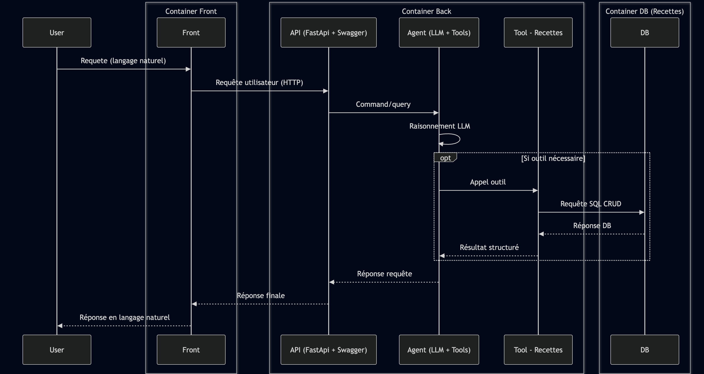

# Site with AI chat

Mini-application "Carnet de recettes" :
- **Backend** FastAPI (Python) avec une API REST pour gérer des recettes
- **Frontend** Next.js 15 (TypeScript) qui consomme l'API
- **Chat IA** : un endpoint `/chat` côté backend que **vous devez implémenter** (LangChain + Azure AI Inference, déploiement **Kimi-K2.6**)

Les consignes pédagogiques détaillées te sont remises séparément par ton formateur.

## Prérequis

- Docker et Docker Compose installés
- Un accès au déploiement Azure AI Foundry (endpoint + clé + nom du modèle), fourni par votre formateur

## Lancement

```bash
# 1. Configurer les variables Azure
cp .env.example .env
# édite .env et renseigne les trois variables AZURE_*
# (endpoint et clé visibles dans Azure AI Foundry → ton projet → Models + endpoints → Kimi-K2.6)

# 2. Démarrer
make up
# (équivalent à : docker compose up --build)
```

Ouvre ensuite :
- Backend (Swagger UI) : <http://localhost:8000/docs>
- Frontend : <http://localhost:3000>

## Vérification rapide

```bash
curl http://localhost:8000/health
# {"status":"ok"}

curl http://localhost:8000/recipes
# Renvoie la liste des recettes pré-remplies

curl -X POST http://localhost:8000/chat \
  -H "Content-Type: application/json" \
  -d '{"message": "Bonjour"}'
# {"reply":"TODO: implémenter le chat. ..."}
```

Le frontend affiche les recettes à gauche et un panneau de chat à droite. Le chat répond actuellement avec un placeholder — **votre travail est d'y brancher un vrai agent LangChain**.

## Comment fonctionne le chat

### Diagramme architectural



### Vue d'ensemble du flux

L'assistant IA suit une architecture **agent-tools** :

```
Utilisateur
    ↓ (langage naturel)
Frontend (React)
    ↓ POST /chat
API (FastAPI)
    ↓ 
Agent LLM (Kimi-K2.6)
    ↓ (raison, puis choisit un outil)
Tool - Recettes
    ↓ (requête SQL CRUD)
PostgreSQL
    ↓ (réponse structurée)
Tool → Agent → API → Frontend
    ↓ (langage naturel)
Utilisateur
```

### Rôle de l'Agent

L'**agent LangChain** (créé via `langchain.agents.create_agent`) orchestestre la conversation :

1. **Reçoit le message** de l'utilisateur via le endpoint `/chat` (POST)
2. **Raisonne** avec le modèle Kimi-K2.6 : "Qu'est-ce que l'utilisateur demande ?"
3. **Choisit un outil** parmi les 4 outils de recettes si nécessaire, ou répond directement si la question est générale
4. **Exécute l'outil** sélectionné
5. **Itère** : utilise le résultat pour continuer le raisonnement jusqu'à pouvoir répondre
6. **Retourne la réponse en langage naturel** à l'API

L'agent a accès à **la mémoire de conversation** : chaque utilisateur a une `session_id` stable (générée côté frontend), ce qui permet à l'agent de se souvenir du contexte entre messages.

### Les 4 outils de l'agent

| Outil | Signature | Exemple | Cas d'usage |
|-------|-----------|---------|-------------|
| **`list_recipes_tool`** | `() → str (JSON)` | `"Quelles recettes as-tu ?"` | Énumère toutes les recettes en base |
| **`get_recipe_by_id_tool`** | `(id: int) → str (JSON)` | `"Montre-moi la recette #2"` | Récupère les détails d'une recette |
| **`create_recipe_tool`** | `(name: str, ingredients: list) → str` | `"Ajoute une recette 'Crêpes' avec ...` | Crée une nouvelle recette en base |
| **`delete_recipe_tool`** | `(id: int) → str` | `"Supprime la recette #1"` | Supprime une recette |

Chaque outil :
- Communique avec le **store PostgreSQL** (`app/store.py` → `SessionLocal` → `RecipeModel`)
- **Retourne un résultat textuel** que l'agent peut lire et interpréter
- Est **une fonction décorée `@tool`** (LangChain) stockée dans `app/tools/recipes/`

### Flux détaillé : exemple utilisateur

L'utilisateur tape : **"Crée une recette 'Tarte à la fraise' avec fraises, pâte brisée et crème"**

```
1. Frontend → POST /chat {message: "...", session_id: "abc123"}
2. Backend API (chat.py) reçoit la requête
3. Agent.invoke() appelé avec:
   - messages: [{"role": "user", "content": "..."}]
   - config: {"configurable": {"thread_id": "abc123"}}
4. Agent raisonne: "L'utilisateur veut créer une recette"
5. Agent choisit l'outil create_recipe_tool
6. Tool.execute() :
   - Crée RecipeModel en base
   - Retourne: "Recette 'Tarte à la fraise' créée avec ID 3"
7. Agent voit le résultat, génère une réponse naturelle:
   - "J'ai ajouté ta recette 'Tarte à la fraise' ! Elle est enregistrée sous l'ID 3."
8. Backend retourne {"reply": "..."}
9. Frontend affiche la réponse ET rafraîchit la liste de recettes
```

### Mémoire conversationnelle

- **Frontend** : génère un `session_id` unique (UUID) au premier chargement du `ChatPanel`, le réutilise pour tous les messages
- **Backend** : passe ce `session_id` comme `thread_id` à la mémoire de l'agent (`InMemorySaver`)
- **LangGraph** : stocke automatiquement l'historique des messages par `thread_id`, donc l'agent "se souvient"

Exemple :
```
Message 1 : "Qui suis-je ?"  →  Agent n'a pas info → "Je ne sais pas"
Message 2 : "Je suis Alice"  →  Sauvegardé dans la mémoire du thread
Message 3 : "Quel est mon nom ?" → Agent retrouve "Alice" dans l'historique
```

### Gestion des erreurs et retry

Si l'API Kimi rencontre une **erreur 429** (capacité dépassée), le endpoint `/chat` implémente un **retry exponentiel** :
- Tentative 1 : immédiate
- Tentative 2 : attendre 2 secondes
- Tentative 3 : attendre 4 secondes

Si tout échoue après 3 tentatives, une erreur HTTP 429 est retournée.

### En résumé

| Composant | Responsabilité |
|-----------|-----------------|
| **API (`/chat`)** | Reçoit la requête HTTP, configure la session, appelle l'agent |
| **Agent** | Raisonne, choisit les outils, orchestre la conversation |
| **Tools** | Exécutent des CRUD recettes, retournent du texte |
| **Database** | Persiste les recettes à long terme |
| **Frontend** | Affiche le chat + liste en temps réel |

## Structure

```
.
├── docker-compose.yml       # Orchestration backend + frontend
├── Makefile                 # Raccourcis make up/down/logs/test
├── backend/
│   ├── Dockerfile
│   ├── pyproject.toml
│   ├── app/
│   │   ├── main.py          # FastAPI app + CORS
│   │   ├── database.py      # SQLAlchemy engine + SessionLocal
│   │   ├── models.py        # RecipeModel ORM
│   │   ├── seed.py          # Initialisation des recettes
│   │   ├── store.py         # CRUD recettes (PostgreSQL)
│   │   ├── agent/           # Agent LLM + outils
│   │   │   ├── builder.py   # Construit l'agent avec les outils
│   │   │   ├── singleton.py # Instance unique de l'agent
│   │   │   ├── prompts.py   # System prompt
│   │   │   └── config.py    # Configuration
│   │   ├── tools/
│   │   │   └── recipes/     # 4 outils de recettes
│   │   │       ├── create_tool.py
│   │   │       ├── getall_tool.py
│   │   │       ├── getbyid_tool.py
│   │   │       └── deletebyid_tool.py
│   │   └── routes/
│   │       ├── health.py
│   │       ├── recipes.py   # ✅ déjà implémenté
│   │       └── chat.py      # ✅ implémenté avec agent LLM
│   └── tests/test_recipes.py
└── frontend/
    ├── Dockerfile
    ├── package.json
    ├── app/                 # Pages Next.js (App Router)
    ├── components/          # RecipeList, ChatPanel
    └── lib/api.ts           # Client REST typé
```

## Commandes utiles

| Commande     | Effet                                            |
|--------------|--------------------------------------------------|
| `make up`    | Build + démarre tout (logs en avant-plan)        |
| `make down`  | Arrête les services                              |
| `make logs`  | Logs en continu                                  |
| `make test`  | Lance les tests pytest du backend                |
| `make clean` | Down + supprime les volumes                      |

## Ressources

- [FastAPI — premiers pas](https://fastapi.tiangolo.com/tutorial/first-steps/)
- [LangChain — `create_agent`](https://docs.langchain.com/oss/python/langchain/agents)
- [`langchain-azure-ai` — chat models](https://python.langchain.com/docs/integrations/chat/azure_ai/)
- [Azure AI Foundry — Inference API](https://learn.microsoft.com/azure/ai-foundry/model-inference/)
- [Next.js App Router](https://nextjs.org/docs/app)
